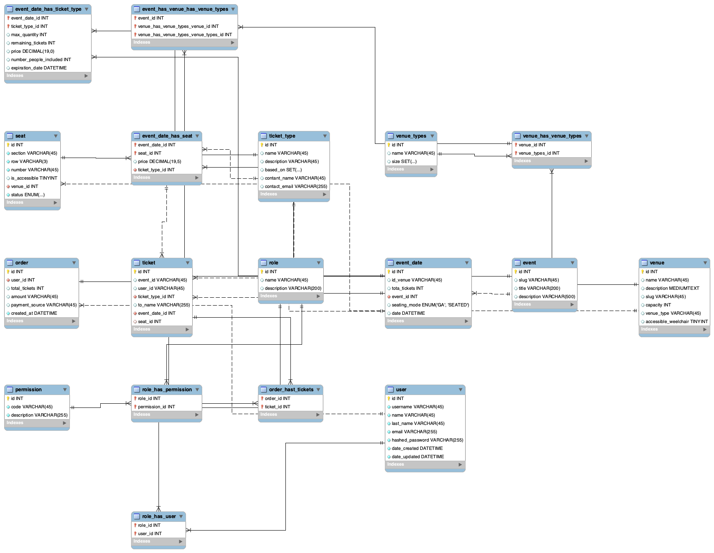

# Ticketbooth Ticket Booking System

End-to-end concert **ticket booking** app with:

- **Frontend:** React + TypeScript
- **Backend:** HTTP API (Node.js + TypeScript or Go)
- **Database:** Relational (MySQL / Postgres)

The system supports:

- Ticket **tiers** (VIP, Front Row, GA)
- **General admission** events (no assigned seats)
- **Seated** events (assigned seats)
- Prevention of **double-booking** under race conditions
- A clean, minimal UI to browse events and book tickets

> Note: User auth is mocked / hardcoded; full auth is intentionally out of scope per the assignment.

---

## High-Level Architecture

- **Client:** React + TS single-page app
  - Pages to list events and event dates
  - Choose ticket quantities (GA) or specific seats (seated events)
  - Calls the backend via JSON REST API

- **API service:** Single stateless HTTP service
  - Exposes REST endpoints under `/api/*`
  - Implements booking logic and concurrency control
  - Uses database transactions

- **Database:** Relational DB (schema supports both GA and seated inventory)
  - Core entities:
    - `event`, `event_date`, `venue`, `seat`
    - `ticket_type` (VIP / Front Row / GA)
    - `event_date_has_ticket_type` (GA inventory)
    - `event_date_has_seat` (seated inventory)
    - `order`, `ticket`
  - Optional: `role`, `permission`, `role_has_user`, `role_has_permission` for simple RBAC

---

## Data Model (Simplified)

### Events and dates

- **event**
  - `id`
  - `slug`
  - `title`
  - `description`

- **event_date**
  - `id`
  - `event_id` → `event`
  - `id_venue` → `venue`
  - `total_tickets` (informational)
  - `event_date` (or datetime)
  - `seating_mode` `ENUM('GA', 'SEATED')`

### Venues and seats

- **venue**
  - `id`
  - `name`
  - `description`
  - `capacity`
  - `venue_type`
  - `accessible_wheelchair`

- **seat**
  - `id`
  - `venue_id` → `venue`
  - `section`, `row`, `number`
  - `is_accessible`

### Ticket types and inventory

- **ticket_type**
  - `id`
  - `name` (`'VIP' | 'FRONT_ROW' | 'GA'`)
  - `description`

- **event_date_has_ticket_type** (GA inventory)
  - `event_date_id` → `event_date`
  - `ticket_type_id` → `ticket_type`
  - `max_quantity`
  - `remaining_tickets`
  - `price`
  - `number_people_included` (for group tickets, if needed)
  - `expiration_date` (optional)

- **event_date_has_seat** (seated inventory)
  - `event_date_id` → `event_date`
  - `seat_id` → `seat`
  - `ticket_type_id` → `ticket_type`
  - `price`

> For GA events, we use `event_date_has_ticket_type` as the source of truth.  
> For seated events, we use `event_date_has_seat` + `ticket` rows.

### Orders and tickets

- **order**
  - `id`
  - `user_id` (mocked user)
  - `total_tickets`
  - `amount`
  - `payment_source` (just a string for simulation)
  - `created_at`

- **ticket**
  - `id`
  - `order_id` → `order`
  - `user_id` (owner; mocked)
  - `event_id`
  - `event_date_id`
  - `ticket_type_id` → `ticket_type`
  - `seat_id` (nullable; `NULL` for GA)
  - `to_name` (name printed on ticket)
  - `created_at`

#### Double-booking protection (seated events)

To prevent two users from booking the **same seat** for a given event date, we add a **unique constraint**:

```sql
ALTER TABLE ticket
ADD CONSTRAINT uniq_ticket_eventdate_seat
UNIQUE (event_date_id, seat_id);

	•	For GA tickets, seat_id is NULL → multiple NULLs are allowed.
	•	For seated tickets, duplicates (event_date_id, seat_id) are rejected at the DB level.

⸻

### Concurrency & Double-Booking Strategy

GA events (seating_mode = 'GA')

Inventory for a given event date and tier is stored in event_date_has_ticket_type:
	•	max_quantity: total capacity for that tier
	•	remaining_tickets: remaining inventory

Booking algorithm (inside a DB transaction):
	1.	For each requested tier (ticket_type_id, qty):

UPDATE event_date_has_ticket_type
SET remaining_tickets = remaining_tickets - :qty
WHERE event_date_id = :eventDateId
  AND ticket_type_id = :ticketTypeId
  AND remaining_tickets >= :qty;


	2.	Check rows_affected:
	•	If 0 → not enough tickets left (another request raced us) → abort transaction.
	•	If 1 → inventory reserved; proceed.
	3.	Insert order + one or more ticket rows with seat_id = NULL.

This UPDATE ... WHERE remaining_tickets >= :qty is atomic and ensures we never oversell, even under concurrent requests.

Seated events (seating_mode = 'SEATED')

For seated events, the frontend sends specific seat_ids for the given event_date_id.

Booking algorithm (inside a DB transaction):
	1.	Create an order row.
	2.	For each requested seat_id, attempt:

INSERT INTO ticket (order_id, user_id, event_id, event_date_id, ticket_type_id, seat_id, to_name, created_at)
VALUES (...);


	3.	If any insert fails with a uniq_ticket_eventdate_seat violation:
	•	Roll back the transaction.
	•	Return a “seat no longer available” error to the client.

The unique constraint is the source of truth that prevents two users from ever owning the same seat for the same event date.

⸻

### Availability, Reliability & Scale (Design Intent)

Availability target: 99.99%

While the implementation for this take-home is single-region and single-instance, the design can scale to 99.99% uptime:
	•	Stateless API service:
	•	All state is in the database, so we can run multiple API instances behind a load balancer.
	•	Health checks & rolling deploys:
	•	A lightweight /health endpoint used by the load balancer.
	•	Database HA:
	•	Use a managed relational database (e.g., RDS, Cloud SQL) with:
	•	Multi-AZ deployment
	•	Automated backups and PITR
	•	Graceful failures:
	•	Booking is idempotent per client request ID (see below).
	•	Errors from inventory checks return clear messages without corrupting state.

Scale assumptions
	•	~1,000,000 DAU
	•	Peak ~50,000 concurrent users

Design choices:
	•	Database-first concurrency control:
	•	Avoid complex in-memory locking so we can scale horizontally.
	•	Rely on row-level locking & unique constraints.
	•	Indexes on hot paths:
	•	event_date_has_ticket_type(event_date_id, ticket_type_id)
	•	event_date_has_seat(event_date_id, seat_id)
	•	ticket(event_date_id, seat_id) (unique)
	•	Read-heavy vs write-heavy flows:
	•	Browsing catalog is read-heavy → can be cached via:
	•	API-side in-memory cache, or
	•	CDN / edge caching for /events, /events/:id.
	•	Booking is write-heavy but relatively low volume compared to reads.
	•	Idempotent booking (optional enhancement):
	•	The client can send an idempotency key header (e.g., X-Idempotency-Key).
	•	The backend stores successful bookings keyed by that value and returns the same result for retries.

Performance target: p95 < 500ms
	•	Keep booking logic to:
	•	1–2 queries for inventory
	•	1 insert for order
	•	N inserts for tickets
	•	Use prepared statements or query builders.
	•	Keep payloads small (only send necessary fields).

⸻

### Database design 



### API Specification


All endpoints are prefixed with /api.
Requests and responses are JSON.

Common types

type SeatingMode = 'GA' | 'SEATED';

type TicketTierName = 'VIP' | 'FRONT_ROW' | 'GA';


⸻

GET /api/events

List all events.

Response 200:

[
  {
    "id": 1,
    "slug": "rock-festival-2025",
    "title": "Rock Festival 2025",
    "description": "Two days of live music.",
    "dates": [
      {
        "id": 10,
        "date": "2025-07-15T20:00:00Z",
        "venueName": "Main Arena",
        "seatingMode": "GA"
      },
      {
        "id": 11,
        "date": "2025-07-16T20:00:00Z",
        "venueName": "Main Arena",
        "seatingMode": "SEATED"
      }
    ]
  }
]


⸻

GET /api/event-dates/:id

Get details for a single event_date (one show).

Response 200:

{
  "id": 10,
  "event": {
    "id": 1,
    "title": "Rock Festival 2025",
    "description": "Two days of live music."
  },
  "date": "2025-07-15T20:00:00Z",
  "venue": {
    "id": 5,
    "name": "Main Arena",
    "capacity": 10000
  },
  "seatingMode": "GA"
}


⸻

GET /api/event-dates/:id/availability

Returns availability depending on seating_mode.

GA example

{
  "seatingMode": "GA",
  "tiers": [
    { "id": 1, "name": "VIP", "price": 100, "remaining": 50 },
    { "id": 2, "name": "FRONT_ROW", "price": 50, "remaining": 200 },
    { "id": 3, "name": "GA", "price": 10, "remaining": 500 }
  ]
}

Seated example

{
  "seatingMode": "SEATED",
  "sections": [
    {
      "section": "A",
      "rows": [
        {
          "row": "1",
          "seats": [
            { "seatId": 101, "label": "A1", "ticketType": "VIP", "price": 100, "available": true },
            { "seatId": 102, "label": "A2", "ticketType": "VIP", "price": 100, "available": false }
          ]
        }
      ]
    }
  ]
}

Availability for seated events can be computed either from:
	•	event_date_has_seat + joined ticket table, or
	•	a materialized view / precomputed cache.

⸻

POST /api/bookings

Create a booking (order + tickets).

This endpoint supports both GA and seated bookings.
The backend branches on the seatingMode of the event_date.

GA request

{
  "eventDateId": 10,
  "customerName": "Alice Example",
  "paymentSource": "test-card-4242",
  "tiers": [
    { "ticketTypeId": 1, "quantity": 2 },   // 2 VIP
    { "ticketTypeId": 3, "quantity": 3 }    // 3 GA
  ]
}

GA success response (201)

{
  "orderId": 123,
  "totalAmount": 230,
  "tickets": [
    {
      "id": 1001,
      "ticketType": "VIP",
      "seatLabel": null,
      "toName": "Alice Example"
    },
    {
      "id": 1002,
      "ticketType": "VIP",
      "seatLabel": null,
      "toName": "Alice Example"
    },
    {
      "id": 1003,
      "ticketType": "GA",
      "seatLabel": null,
      "toName": "Alice Example"
    }
  ]
}

If inventory is insufficient for any tier:

Response 409 (Conflict):

{
  "error": "INSUFFICIENT_INVENTORY",
  "message": "Not enough tickets left for VIP."
}


⸻

Seated request

{
  "eventDateId": 11,
  "customerName": "Bob Example",
  "paymentSource": "test-card-4242",
  "seats": [
    { "seatId": 201, "ticketTypeId": 1 },
    { "seatId": 202, "ticketTypeId": 1 }
  ]
}

Seated success response (201)

{
  "orderId": 124,
  "totalAmount": 200,
  "tickets": [
    {
      "id": 1010,
      "ticketType": "VIP",
      "seatLabel": "A1",
      "toName": "Bob Example"
    },
    {
      "id": 1011,
      "ticketType": "VIP",
      "seatLabel": "A2",
      "toName": "Bob Example"
    }
  ]
}

If any seat was already taken due to concurrency and the unique constraint fails:

Response 409 (Conflict):

{
  "error": "SEAT_ALREADY_TAKEN",
  "message": "One or more selected seats are no longer available."
}


⸻

GET /api/orders/:id

Fetch a specific order with its tickets (useful for confirmation page).

Response 200:

{
  "id": 124,
  "createdAt": "2025-07-15T21:00:00Z",
  "customerName": "Bob Example",
  "totalAmount": 200,
  "tickets": [
    {
      "id": 1010,
      "eventTitle": "Rock Festival 2025",
      "eventDate": "2025-07-16T20:00:00Z",
      "ticketType": "VIP",
      "seatLabel": "A1"
    }
  ]
}


⸻

GET /api/orders?userId={id}

List every order for a specific user (most recent first). Each order includes aggregate fields from the `order` table plus the fully-expanded ticket information.

Response 200:

[
  {
    "id": 124,
    "createdAt": "2025-07-15T21:00:00Z",
    "customerName": "Bob Example",
    "totalAmount": 200,
    "tickets": [
      {
        "id": 1010,
        "eventTitle": "Rock Festival 2025",
        "eventDate": "2025-07-16T20:00:00Z",
        "ticketType": "VIP",
        "seatLabel": "A1"
      }
    ]
  },
  {
    "id": 123,
    "createdAt": "2025-07-01T20:10:00Z",
    "customerName": "Bob Example",
    "totalAmount": 90,
    "tickets": [
      {
        "id": 900,
        "eventTitle": "Indie Night",
        "eventDate": "2025-07-20T19:00:00Z",
        "ticketType": "GA",
        "seatLabel": null
      }
    ]
  }
]

Client code must pass the `userId` query parameter (e.g. `/api/orders?userId=1`). The endpoint returns an empty array when the user has no orders.


⸻

POST /api/signup

Register a new user (first name, last name, email, username, password). The same payload is accepted by the internal `/api/users` admin endpoint.

Request

{
  "firstName": "Alice",
  "lastName": "Example",
  "email": "alice@example.com",
  "username": "aliceex",
  "password": "password123"
}

Success response (201)

{
  "id": 42,
  "username": "aliceex",
  "firstName": "Alice",
  "lastName": "Example",
  "email": "alice@example.com",
  "createdAt": "2025-05-01T18:12:00Z",
  "updatedAt": "2025-05-01T18:12:00Z"
}

If a user already exists with the same email:

Response 409 (Conflict):

{
  "error": "USER_EXISTS",
  "message": "A user with that email already exists"
}

⸻

POST /api/login

Authenticate a user with their email (or username) + password. Returns a short-lived opaque token plus user info.

Request

{
  "email": "alice@example.com",
  "password": "password123"
}

Success response (200)

{
  "token": "eyJhbG...",
  "user": {
    "id": 42,
    "username": "aliceex",
    "firstName": "Alice",
    "lastName": "Example",
    "email": "alice@example.com"
  }
}

If the credentials are invalid:

Response 401 (Unauthorized):

{
  "error": "UNAUTHORIZED",
  "message": "Invalid credentials"
}

⸻

### Local Development

Adjust this section to match your actual implementation (Node or Go).
Here’s a Node.js + TypeScript oriented example.

Prerequisites
	•	Node.js >= 20
	•	npm or pnpm
	•	MySQL or Postgres running locally (or via Docker)

Backend

Stack
	•	Language: Go (1.21+)
	•	Router: github.com/go-chi/chi/v5 (lightweight, nice)
	•	DB: MySQL with github.com/go-sql-driver/mysql
	•	DB helper (optional but nice): github.com/jmoiron/sqlx for nicer scanning

folder structure 
```
backend/
  cmd/
    api/
      main.go            # starts HTTP server, sets up routes and DB connection
  internal/
    http/
      router.go          # API route registrations
      handlers.go        # HTTP handlers (events, bookings, etc.)
    db/
      db.go              # DB connection, helpers, transaction helpers
    tickets/
      service.go         # booking logic (GA + seated)
      models.go          # Go structs for ticket/order/event_date, etc.
migrations/
  README.md              # migration info
  001_initial.sql        # initial schema
.gocache/
  README                 # Go build cache info
```

### Frontend

The frontend assumes the backend is available at http://localhost:4000/api.

## Trade-offs & Future Improvements
	•	Add Unit tests
        Example concurrent test idea:
        •	Spawn 10 parallel requests trying to buy the last 1 VIP ticket.
        •	Expect exactly 1 success and 9 failures with INSUFFICIENT_INVENTORY.

	•	Single DB: For simplicity, everything is in one relational DB. At scale, catalog reads could be moved to a separate read replica or cache.
	•	Payments: Payment flow is simulated; in a real system we would integrate with a provider (Stripe, etc.) and handle:
	•	Idempotency keys
	•	Webhook-based confirmation
	•	Seats UX: For seated events, the UI currently uses a simple grid/list. It could be upgraded to an interactive seat map.
	•	RBAC: A full role/permission system is modeled in the schema but not fully implemented in code. It can be used to restrict which users can create/update events and venues.
	•	Multi-region: To hit true 99.99% in production, we’d:
	•	Run the API in multiple regions
	•	Use a globally accessible DB (or per-region DB with strong consistency for booking writes)
	•	Keep the booking write path in a single primary region and fan out reads globally.

⸻

## Conclusion

This project focuses on:
	•	Clear domain modeling for events, venues, and tickets
	•	Correct handling of concurrency and double-booking
	•	A straightforward React UI for booking
	•	A backend API that can be implemented in either Node.js + TypeScript or Go, while preserving the same data model and guarantees.
